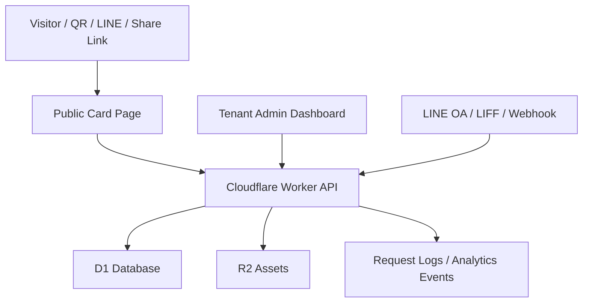

# Architecture

## 1. System Boundary

The SaaS runtime should stay simple and maintainable:

- Public card pages: fast, cacheable, mobile-first.
- Admin dashboard: authenticated tenant/member management.
- API: tenant, card, button, lead, event, analytics, export.
- LINE integration: optional per tenant, not required for every card.
- AI workflow: planning, documentation, QA, copy suggestions, and operator support only.

## 2. Suggested Cloudflare Stack

## 3. Main Modules

- Tenant module: company profile, plan, brand colors, LINE settings.
- Member module: profile, title, contact channels, publish status.
- Card module: public card content, slug, theme, sections, CTA ordering.
- Lead module: submitted form data, source attribution, status, notes.
- Event module: view, click, form_submit, vcard_download, line_follow_click.
- CRM module: filtering, status updates, export.
- LINE module: LIFF identity, LINE user mapping, webhook postback source, tag rules.
- Admin module: role-based access and audit logs.

## 4. API Draft

Public:

- `GET /c/:slug` - render public card.
- `GET /api/public/cards/:slug` - fetch public card data.
- `POST /api/public/cards/:slug/events` - record views and clicks.
- `POST /api/public/cards/:slug/leads` - submit lead form.
- `GET /api/public/cards/:slug/vcard` - download vCard.

Tenant admin:

- `GET /api/admin/me`
- `GET /api/admin/cards`
- `POST /api/admin/cards`
- `PATCH /api/admin/cards/:id`
- `POST /api/admin/cards/:id/publish`
- `GET /api/admin/leads`
- `PATCH /api/admin/leads/:id/status`
- `GET /api/admin/analytics`
- `GET /api/admin/export/leads.csv`

LINE:

- `POST /line/webhook`
- `GET /liff/card/:slug`
- `POST /api/line/link-profile`
- `POST /api/line/postback`

## 5. Permissions

- `owner`: manage tenant, billing, LINE settings, all cards and leads.
- `manager`: manage team cards and leads.
- `member`: edit own card and own leads.
- `viewer`: read-only analytics and CRM.

## 6. Runtime Rules

- Do not store LINE tokens in source code.
- Do not log access tokens, phone numbers, raw LINE profile payloads, or full lead notes.
- Every public write endpoint must rate limit by IP, card id, and session token.
- Lead form fields must be minimal and purpose-specific.
- CSV export requires authenticated admin role.
- Webhook must verify LINE signature before processing.

